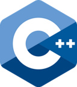
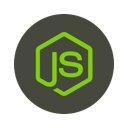

# bzd Framework

[](https://travis-ci.com/blaizard/bzd)
[](https://github.com/blaizard/bzd/actions)

Access the [rendered version of this documentation](https://blaizard.github.io/bzd).

Fullstack, lightweight and flexible framework for IoT applications.
This mono-repository enables the following technologies:

|             C++20              |            Python3.11             |           Node (v20+)           |              Vue               |              Bazel               |              Eagle               |
| :----------------------------: | :-------------------------------: | :-----------------------------: | :----------------------------: | :------------------------------: | :------------------------------: |
|  |  |  |  |  |  |

## Overview

This framework is built to run on all sort of embedded platforms, from bare metals 8-bit microcontrollers to high performance compute units.
It is made to remove any dependencies from STL, but provide a similar set of components and utilities to develop applications in an
efficient and safe manner.

It features the following:

- No dynamic allocations. All storage is declared either at compile time or on the stack.
- The core library is self contained, no reliance on third-party, only on the freestanding STL.
- Flexible error handling model.
- Based on C++ coroutines.
- Compile-time string formatting tool.
- Lightweight.
- Useful set of containers.

## Platforms

The following target platforms are currently supported:

| Name                 | Compiler | Version | Executors   | Debug |
| -------------------- | -------- | ------- | ----------- | ----- |
| linux_x86_64_clang\* | clang    | 17.0.2  | host\*      |       |
| linux_x86_64_gcc     | gcc      | 13.1.0  | host\*      |       |
| esp32_xtensa_lx6_gcc | gcc      | 12.2.0  | sim\*, uart | x     |

\* Default.

When debug is supported by the platform, one can run a target with `--config=debug` option and a debug environment will
be made available.

## Build

### Locally

To build everything, just run:

```bash
bazel test //...
```

This will build locally, it will fetch all tools needed to build on your machine.

### Remote

Remote execution is also supported and is enabled by first deploying on a server the predefined Buildbarn configuration:

```bash
./tools/buildbarn/run.sh
```

Then to build bazel targets simply run bazel appended with `--config=remote`.

For debugging purposes, toolchains can be run locally in a docker sandbox which is very similar to what runs on remote execution.
To enable this configuration, run bazel with `--config=docker`.

## Code Quality

All supported languages come with their set of code quality related tools.
To run all static sanity checks at once, code formatters and documentation generators, run the following command:

```bash
bazel run //:sanitizer
```

To run all tests, run the following command:

```bash
./quality_gate.sh
```

This is a non-exhaustive list of languages and their supported tools. In addition to that
formatter and linters for YAML, json and markdown are also available.

| Language | Formatters   | Code Analyzers                      | Code Coverage | Test Framework | Documentation |
| -------- | ------------ | ----------------------------------- | ------------- | -------------- | ------------- |
| C++      | clang-format | clang-tidy, asan, lsan, tsan, ubsan | Yes           | Yes            | doxygen-based |
| Python   | yapf         | mypy                                | Yes           | Yes            |               |
| Node     | prettier     | eslint                              | Yes           | Yes            |               |
| Skylark  | buildifier   | buildifier                          |               |                | stardoc       |

## Naming Convention

The code in this repository follows several principle regarding naming convention. The following rules are applied cross languages.

- Files and directories are named lower case `snake_case` using only the characters matching the regexpr: `[a-z0-9_/.]`. This is enforced by tools/sanitizer/actions/structure.
- Variables, constants, functions, concepts, namespaces are named in `camelCase`.
- All types are named in `PascalCase`.
- Non-public members (variables, functions...) are appended with a `_` character.
- All namings try to avoid abbreviations.

## Memory Footprint

All classes offered by this library have the same objective to have a fixed memory size. Their footprint or maximum size
is determined at compile time, ensuring no memory allocation at runtime, making this library ideal for any safety-critical application.

## TODO

- Fix this test: //cc/bzd/core/async/tests:multithread (it hangs from time to time with clang prod).
