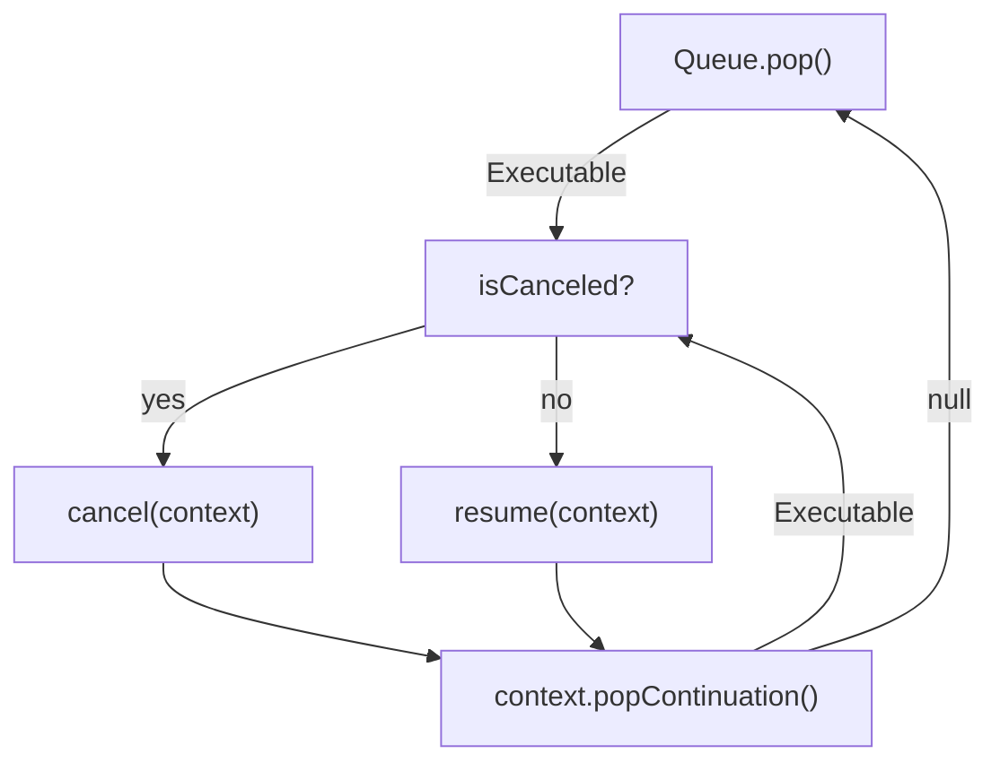

# Coroutines

## Compiler Point of View

### Handle

The thing referred by `bzd::coroutine::impl::coroutine_handle<>` is an object, that refers to the coroutine’s dynamically allocated state.
Thanks to this object you can, for example, resume the coroutine. The coroutine_handle is a templated type, where Promise type is its template argument.

### Frame

The frame contains the current state of the coroutine.
Coroutine function is created by the compiler when you call a new coroutine, for example `auto resumable_object = bzd::delay(10_ms);`

```c++
Async<> bzd::delay(args...)
{
    auto* frame = new CoroDelayFrame{args...};
    auto return_object = frame->_promise.get_return_object();

    co_await frame->_promise.initial_suspend();
    try
    {
        // Coroutine body.
    }
    catch (...)
    {
        frame->_promise.unhandled_exception();
    }

final_suspend:
    co_await frame->_promise.final_suspend();
    delete frame;

suspend:
    return return_object;
}
```

Where the coroutine frame looks something like this:

```c++
struct CoroDelayFrame
{
    Async<>::promise_type _promise;
    // storage for argument passed to coroutine.
    // storage for local variables.
    // storage for representation of the current suspension point.
};
```

Where a `co_await` statement looks something like this:

```c++
{
    auto&& awaiter = //<get-awaitable>;
    if (!awaiter.await_ready())
    {
        // Save the current state of the coroutine.
        // <suspend-coroutine>
        if (awaiter.await_suspend(std::coroutine_handle<> p))
        {
            // <return-to-caller-or-resumer>
        }
        // <resume-point>
    }
    awaiter.await_resume();
}
```

Where `<get-awaitable>` is something like this:

```c++
template<typename P, typename T>
decltype(auto) get_awaitable(P& promise, T&& expr)
{
    if constexpr (has_any_await_transform_member_v<P>)
        return promise.await_transform(static_cast<T&&>(expr));
    else
        return static_cast<T&&>(expr);
}

template<typename Awaitable>
decltype(auto) get_awaiter(Awaitable&& awaitable)
{
    if constexpr (has_member_operator_co_await_v<Awaitable>)
        return static_cast<Awaitable&&>(awaitable).operator co_await();
    else if constexpr (has_non_member_operator_co_await_v<Awaitable&&>)
        return operator co_await(static_cast<Awaitable&&>(awaitable));
    else
        return static_cast<Awaitable&&>(awaitable);
}

// <get-awaitable> -> co_await expression;
auto&& value = expression;
auto&& awaitable = get_awaitable(promise, static_cast<decltype(value)>(value));
auto&& awaiter = get_awaiter(static_cast<decltype(awaitable)>(awaitable));
```

## Async implementation

### Task

`bzd::Async` is the task-coroutine type of this framework.

A `void` coroutine is declared as follow:

```c++
bzd::Async<> myFunc() { ... }
```

A non-`void` coroutine is declared as follow:

```c++
bzd::Async<int> myFunc() { ... }
```

### Generator

`bzd::Generator` is the generator-coroutine type of this framework.

A `void` generator is declared as follow:

```c++
bzd::Generaotr<> myFunc() { ... }
```

A non-`void` coroutine is declared as follow:

```c++
bzd::Generator<int> myFunc() { ... }
```

### Composition

#### All

Coroutine can be composed and executed in parallel, depending on the executor used underneath.

To have multiple coroutine run in parallel, this can be done as follow:

```c++
const auto result = co_await bzd::async::all(myFunc(), myFunc(), myFunc());
```

This will execute myFunc (assuming it is a coroutine), 3 times and return the result as a tuple.

#### Any

You might also want to execute coroutine and return when the first one terminates, this is handy to implement
timeouts for example. It can be done as follow:

```c++
const auto result = co_await bzd::async::any(myFunc(), timeout(1_s));
```

This will return a result that is a tuple of optional results of the 2 coroutine executed.

### Error propagation

Some errors cannot be treated at the caller level and might have to be propagated to the upper layers. For that the Async
type provides a convenient operator to reduce boiler plate code:

```c++
const auto value = co_await !myFunc();
```

The value is directly returned from the coroutine, any error is propagate to the caller of this coroutine. This piece of code
is equivalent to the follwing:

```c++
auto result = co_await myFunc();
if (!result)
{
    co_return bzd::move(result).propagate();
}
const auto value = result.value();
```

The error propagate goes to upper levels until an awaitable handling errors is found.

Error propagation can also apply to `bzd::async::any` coroutines, and it will ensure the coroutine at a specific index
returns a valid result, otherwise the error will be propagate to the caller.

```c++
const auto value = co_await !bzd::async::any(myFunc(), timeout(1_s));
// or
const auto value = co_await bzd::async::any(timeout(1_s), myFunc()).assertHasValue<1>();
```

### Suspend

Suspending the execution of an async can be done with `bzd::async::suspend(...)`. This function takes 2 callables as arguments,
the first, that is guaranteed to be called, contains a movable-only suspended executable object as argument.
The user needs to dispose it from this callback.
The second argument is optional and provides a callback to deal with cancellation.

In the context of ISR, when only a wait-free operation is required, `bzd::async::suspend` should not be used as it uses a lock.
Instead, `bzd::async::suspendForISR` can be used and uses the same arguments as its counterpart.

### Executor

The executors are used to run and schedule asyncs (aka coroutines).

This is what the executor flowchart looks like;



The executor context, is unique to the instance of the executor, it is passed to the current coroutine being executed or cancelled.
It has for role to contain the continuation if any, that will be used for the next coroutine to be executed. This could be done
directly by returning it in the `await_suspend`, this would work fine in a single threaded system. Here we want to allow parallel
execution on different cores if available, and for branching (`async::all` or `async::any`), we would have a race if multiple
continuation are called concurrently. Having it after the completion of the coroutine helps with that effect, because it ensures that
the parent is completed before the execution of the continuation.
