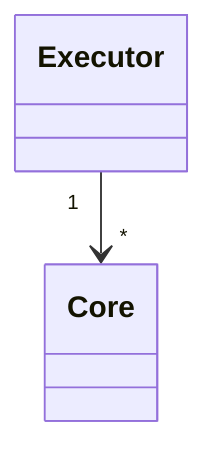

# Executors

An executor is a group of computation units (cores) that can share workloads between each others.
They share the same work queue and a component gets executed on an arbitrary core.



Cores can be assigned with a maximum load or other specific atrtibutes.

```bdl
// A workload will run on either core0 or core1.
composition
{
   core0 = FreeRTOS(stackSize = 4000, load = 20%);
   core1 = FreeRTOS(stackSize = 10000);
   esp32 = Executor(core0, core1);
}
```

Sometimes, for portability purpose, you might want to inject the knowledge of cores at runtime.
To do so, a platform specific executor can be made, abstracting the notion of cores.
For example, a linux machine can be composed as follow:
```bdl
composition
{
   linux = LinuxExecutor;
}
```

Multiple executors can be created and deployed on the same process/binary, this can be usefull to have different task priorities for example.

## Default executor

For each supported platform a default executor is available, it's full qualified name is `executor` and resides at the top level.

## Association

A component instanciation defines where the components resides and run. This is done with the `executor` contract.
```bdl
composition
{
   comp1 = Component [executor(linux)];
}
```
If omitted, the component will run on the default `executor`.
