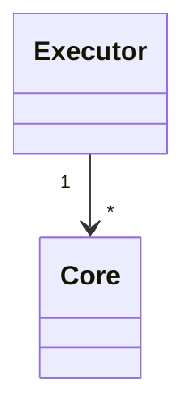

# Executors

An executor is a group of computation units (cores) that can share workloads between each others (by work-stealing strategy).
They share the same work queue and a component gets executed on an arbitrary core.



Cores can be assigned with a maximum load or other specific attributes (to be implemented).

```bdl
// A workload will run on either core0 or core1.
composition
{
   core0 = FreeRTOS(stackSize = 4000, load = 20%);
   core1 = FreeRTOS(stackSize = 10000);
   esp32 = Executor(core0, core1) [executor];
}
```

Sometimes, for portability purpose, you might want to inject the knowledge of cores at runtime.
To do so, a platform specific executor can be made, abstracting the notion of cores.
For example, a linux machine can be composed as follow:

```bdl
composition
{
   linux = LinuxExecutor [executor];
}
```

Multiple executors can be created and deployed on the same process/binary, this can be useful to have different task priorities for example.

## Thread safety

By default a component or task is assigned to a specific core during its lifetime. This done at runtime as the number of cores is not always known at build time.
This ensures that all resources within a component is accessible safely.

### Interaction between components

Components have various ways to interact with each others.

- They can be passed as `config`.
- They can be passed as argument through their interface.
- They can use variables to communicate.

To identify on which core, which component should run on, it depends on its dependency with others.
If a non-thread safe component is a dependency of another component, they will both run on the same core.
However, if it is marked with the tag `[threadsafe]`, it will be scheduled on any available core.

If the only dependency is through variables, it is also considered as thread safe.

An error will be raised if there is no possible combination. For example, if 2 workloads executed on different executors depend on a 3rd component that is not threadsafe.

## Default executor

When the system only has a single executor, it is automatically assigned to all workloads, therefore there is no need for specific assignment.

## Association

If the system contains multiple executor, however, it is necessary to define where workloads are running.

This can be done in 2 different ways. By either specifying it at component instantiation, This is done with the `executor` contract.

```bdl
composition
{
   comp1 = Component [executor(linux)];
}
```

or separately from the component, using the builtin function `bind`, to bind a fqn or a regular expression to an executor, for example:

```bdl
composition
{
   bind(/comp1.*/) [executor(linux)];
}
```

This tells that all fqn starting with `comp1` will be assigned to the executor `linux`.
