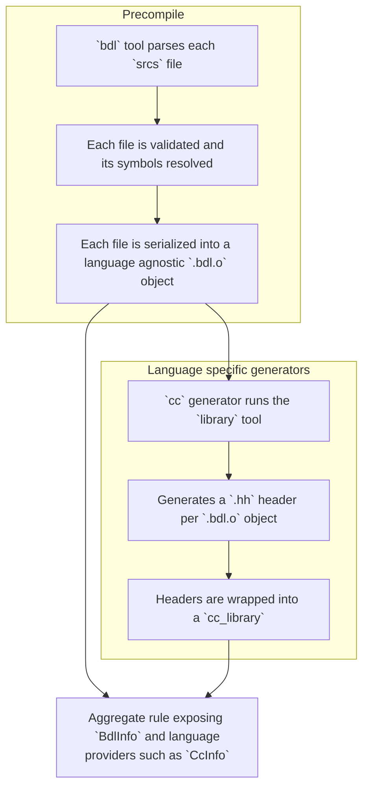

# Library

A library is a group of `bdl` files that are pre-compiled once into a language agnostic intermediate format, and made
available to other rules, such as a composition or another library.

## Definition

Defining a library is done with Bazel through a rule, as follows:

```bzl
load("@bzd_bdl//:defs.bzl", "bdl_library")

bdl_library(
    name = "io",
    srcs = [
        "io.bdl",
    ],
    deps = [
        ":network",
    ],
    implementation = {
        "cc": "//cc/components/posix/io/impl:file_descriptor",
    },
    presets = [
        "//config:my_preset.json",
    ],
    visibility = ["//visibility:public"],
)
```

`srcs` are the BDL files that compose the library, `deps` are other `bdl` targets used to resolve symbols defined
across files, and `presets` are JSON files referenced by `preset NAME from "PATH";` statements.

`implementation` is a dictionary keyed by language, mapping to a target that provides the language specific
implementation of the entities declared in the BDL files, for example a C++ library defining the components. The
implementation is added to the generated code of the corresponding language so that the generated interface can be
linked against it.

A library always exposes a `BdlInfo` provider, together with the language specific providers of the generated code for
each registered language, for example `CcInfo` for C++.

## Process

A library rule will perform the following operations to generate its outputs:



The precompile stage is language agnostic and happens only once per library. Its output, a `.bdl.o` object per input
file, is cached and reused by every consumer, this stage is the same as the one described in the
[build](build.md) documentation.

The generators stage is then run for each language extension registered with the `bdl_extension` module extension. The
extension declares a `library.generator` rule that consumes the precompiled objects and the providers it contributes to
the library, for example the `cc` extension:

- Runs the `library` tool that turns each precompiled `.bdl.o` object into a `.hh` header.
- Wraps those headers into a `cc_library`, together with the BDL adapter types and the dependencies.
- Exposes the resulting `CcInfo` provider.

The `implementation` attribute of the library is passed as a dependency to the generator of the matching language, so
the generated code is linked against the implementation provided by the user.

Consumers of a library therefore use the language artifacts they need, for example a C++ binary includes the generated
headers and links against the generated `cc_library`, see the C++ generator for details.
