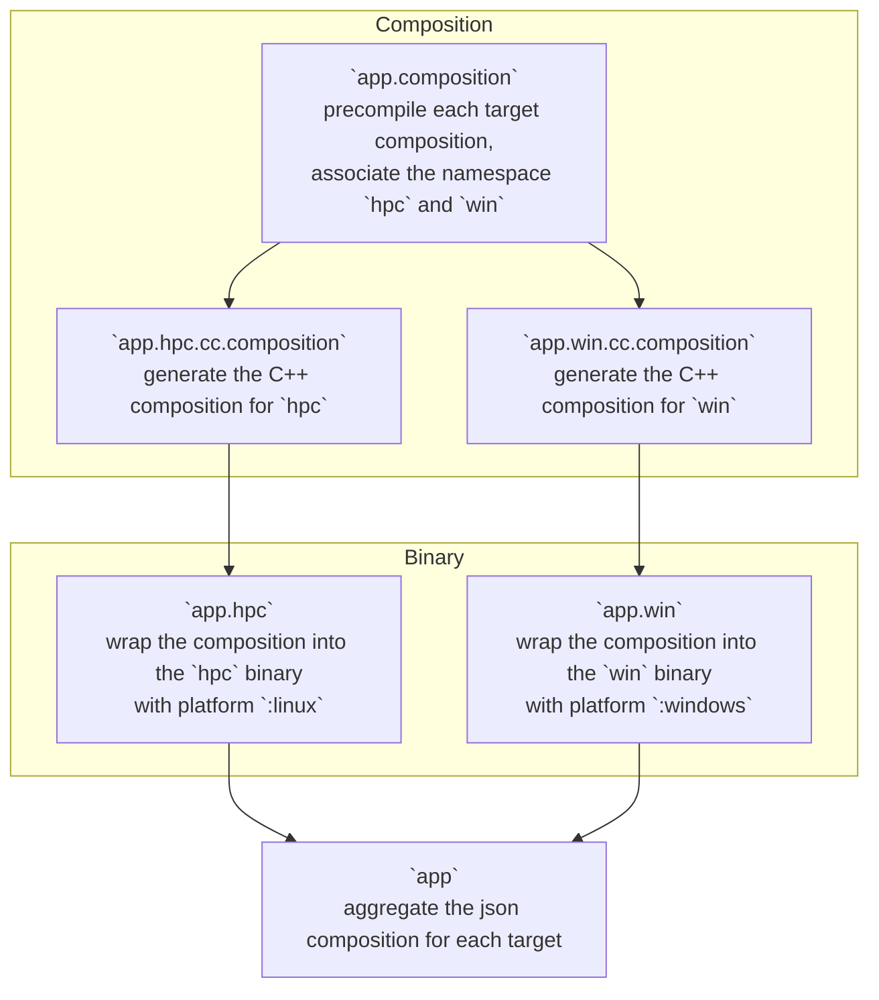

# System

A system is a group of targets. It constitutes one or multiple binaries that are ready for deployment.
It is the most top level view of the composition.

## Definition

Defining a system is done with Bazel through a rule, as follows:

```bzl
load("@bzd_bdl//:defs.bzl", "bdl_library", "bdl_system")

bdl_library(
    name = "composition",
    srcs = [
        "composition.bdl",
    ],
    implementation = {
        "cc": "//path/to/my/implementation",
    },
)

bdl_system(
    name = "application",
    targets = {
        "esp32": "//cc/targets/esp32:gcc",
        "hpc": "//cc/targets/linux:x86_64_clang",
    },
    deps = [
        ":composition",
    ],
)
```

This means that this system contains 2 binaries, the first one runs on a C++ `esp32` target platform and its
executors are referred to under the namespace `esp32`. Similarly the second one runs on a C++ `linux` platform and is defined
under the namespace `hpc`.

The `deps` are `bdl_library` targets that contain the composition BDL files shared by all the targets of the system.

Under the hood, this macro expands into several rules, one composition process per target, one binary per target and one
system rule aggregating the results, all of them using the same composition BDL files.

## Target

Each entry of the `targets` dictionary references a `bdl_target`. A target describes a binary: its composition files,
its platform, its language and its dependencies.

```bzl
load("@bzd_bdl//:defs.bzl", "bdl_target")

bdl_target(
    name = "x86_64_clang",
    composition = [
        "composition.bdl",
    ],
    language = "cc",
    platform = "@clang//:platform-linux-x86_64",
    deps = [
        ":main",
    ],
    visibility = ["//visibility:public"],
)
```

Note that a target whose name ends with `auto` must not define a `platform` attribute. In this case the platform is
provided by platform specific variants that inherit the composition, deps and language via the `parent` attribute.
A `bdl_target` always generates a `<name>.platform` alias used for the platform transition of the resulting binary.

## Process

A system rule will perform the following operations to generate the various binaries for the system.
Given the following targets:

```bzl
bdl_target(
    name = "a",
    composition = [
        "a_composition.bdl",
    ],
    deps = [
        "//:a_lib",
    ],
    language = "cc",
    platform = "@target_platform//:linux",
)

bdl_target(
    name = "b",
    composition = [
        "b_composition.bdl",
    ],
    deps = [
        "//:b_lib",
    ],
    language = "cc",
    platform = "@target_platform//:windows",
)

bdl_system(
    name = "app",
    targets = {
        "hpc": ":a",
        "win": ":b",
    },
    deps = [
        "//:lib",
    ],
)
```



The first step precompiles the composition BDL files of every target, injecting each target name as the namespace in
which its executors are resolved. This single step is shared by all targets.

Then, for each registered language extension, a composition generator produces the language specific composition output.
For example the `cc` extension generates a `cc_binary` from the composition, while the `json` extension generates the
json representation of the system. This is done per target, with the platform transition applied to the binary.

Finally, one `_bdl_binary` rule per target wraps the generated composition into the actual binary using the target's
`binary` executable when set, and a `_bdl_system` rule aggregates the json compositions of every target into a
`BdlSystemJsonInfo` provider, available to downstream rules such as deployment.

## Parameters

/!\ This is not implemented yet.

Some attributes might require parametrization, for example when defining a gateway for a specific platform, the IP address
might be needed for an ethernet-based gateway.
This can be done via composition using the contract `override` to tell that this symbol is overriding an existing symbol.
Not adding this contract will result in a symbol conflict and raise an error.

Note that parameters are only overridable at composition stage. This information is passed top down to the component via its
configuration. This is different from Bazel build settings mechanism for example where such variant is passed through the
build tree and available at all stages of the build.

```bd
// How it might be defined.
composition gateway.ethernet {
    ip = String;
}

// How it might be overwritten.
composition {
    esp32.gateway.ethernet.ip = "192.168.0.12" [override];
}
```
