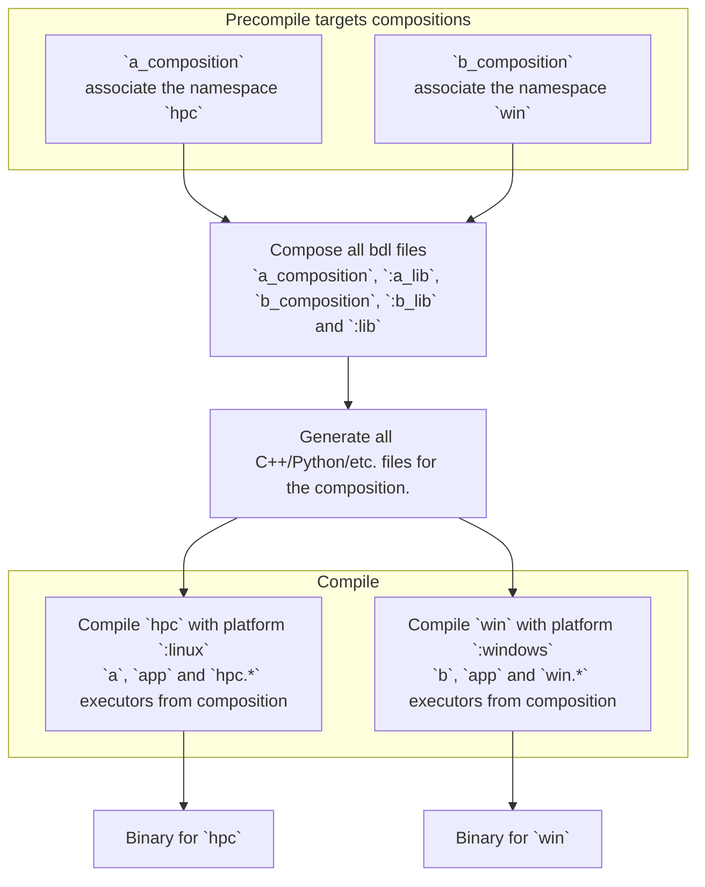

# System

A system is a group or targets. It constitutes one or multiple binaries that are ready for deployment.
It is the most top level view of the composition.

## Definition

Defining a system is done with Bazel through a rule, as follow:

```bzl
bdl_system(
    nae = "application",
    targets = {
        "esp32": "//cc/targets/esp32_xtensa_lx6",
        "hpc": "//cc/targets/linux:x86_64_clang",
        "script": "//python/targets/linux",
    },
    deps = [
        "//:lib"
    ],
)
```

This tells that this system contains 3 binaries, the first one runs on a C++ `esp32_xtensa_lx6` target platform and which
executors are referred under the namespace `esp32`. Similarly the second one runs on a C++ `linux` platform and is defined
under the namespace `hpc`. The third one, is a python binary that runs under `linux` and defined under `script` namespace.

Under the hood, this rule will invoke 1 composition process and 3 binary rules that uses the same composition BDL files.

To describe a target, the user should use the following rule:

```bdl
bdl_target(
    name = "x86_64_clang",
    compositions = [
        "composition.bdl",
    ],
    platform = "//platform:linux_x86_6registry4_clang",
    language = "cc",
    deps = [
        ":lib",
    ]
)
```

## Process

A system rule will perform the following operations to generate the various binaries for the system.
Givien the following targets:

```bdl
bdl_target(
    name = "a",
    composition = [
        "a_composition.bdl",
    ],
    deps = [
        "//:a_lib",
    ],
    platform = "@target_platform//:linux",
    language = "cc"
)
bdl_target(
    name = "b",
    composition = [
        "b_composition.bdl",
    ],
    deps = [
        "//:b_lib",
    ],
    platform = "@target_platform//:windows",
    language = "cc"
)
bdl_system(
    name = "app",
    targets = {
        "hpc": ":a",
        "win": ":b",
    },
    deps = [
        "//:lib"
    ],
)
```



## Parameters

/!\ This is not implemented yet.

Some attributes might require parametrization, for example when defining a gateway for a specific platform, the IP address
might be needed for an ethernet-based gateway.
This can be done via composition using the contract `override` to tell that this symbol is overriding an existing symbol.
Not adding this contract will result into a symbol conflict and raise an error.

```bd
// How it might be defined.
composition gateway.ethernet {
    ip = String;
}

// How it might be overwritten.
composition {
    esp32.gateway.ethernet.ip = "192.168.0.12" [override];
}
```
